# Buffers and Voltage Controlled Buffers 
There are three folders containing three vivado projects.  In this lab and all other labs, you will be asked to demonstrate each circuit to an instructor, answer the questions (look up the answer online or make a hypothesis). Suggest you edit this readme file. 

## Buffers

#### Port Diagram

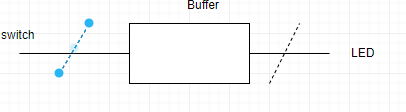

#### Verilog Code

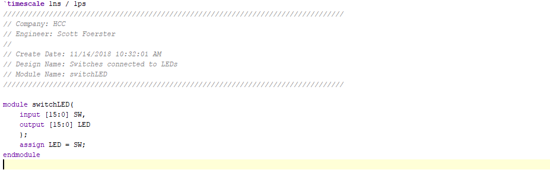

#### RTL Schematic Screen shot

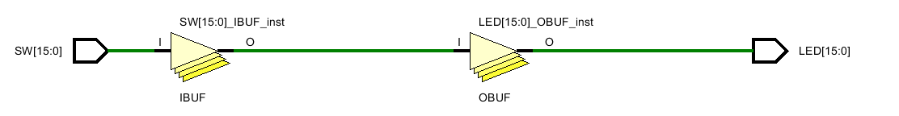

#### Synthesis Schematic Screen shot

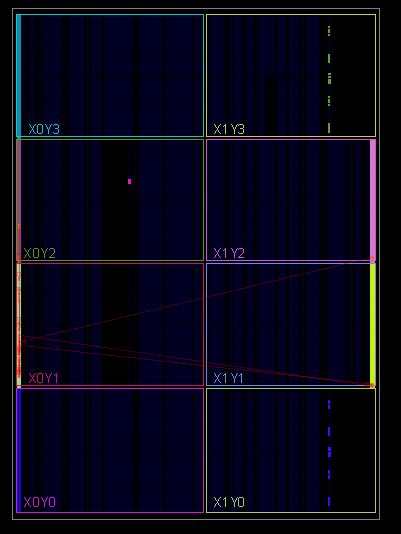

#### Implementation Device screen shot zoomed in on something 

#### interesting

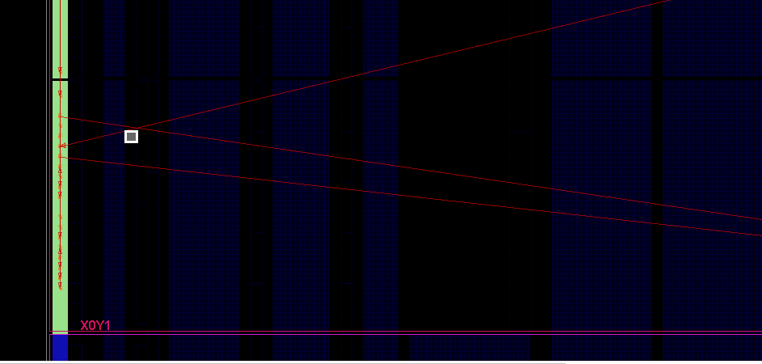

#### Testing

*What is a net?*    

 **A Wire.**

What is a cell? 

**A series of wires.**

What is an IO port?  

**input/output port.** 

What do the yellow triangles labeled OBUF do?  

**they are buffers, they slow and restrict data/current.**

What physically is a zero?

**nothing, empty space.**

What logically is a zero? 

**Boolean false. nothing but not null.**

What physically is a one?  

**a material object, something that exists.** 

What logically is a one?

**a true statement, something exists there.**

## MultipleLEDs  
#### Port Diagram

#### Verilog Code

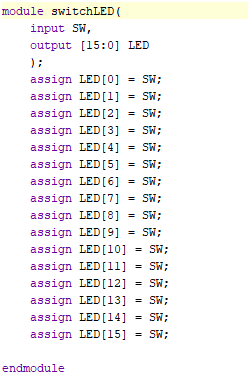

#### RTL Schematic Screen shot

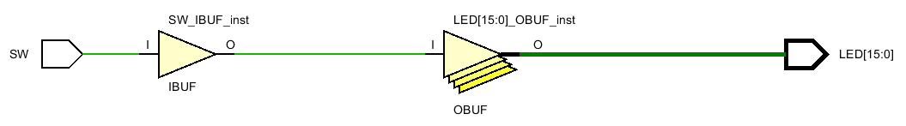

#### Synthesis Schematic Screen shot

#### Implementation Device screen shot zoomed in on something interesting

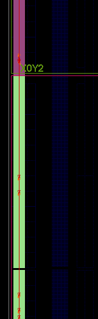

#### Testing

Look at the verilog code and the constraints file.  

Make modifications so that one switch drives mutliple LED's.  

*How many LED's can one switch drive?* 

**no limit.**

*If vivado fails, where does it fail (RTL. Synthesis, Implementation or Bit File Generation), what is the error message?  What does the error message mean in your own words?*

**no failures**.

*Instead of 16 lines of verilog code, everything can be put in one line. What is this one line?*

**assign LED[15 : 0] = SW.**

## MultipleSwitches

This project or circuit fails. Two switches can not drive one LED.  Take screen shots until you reach an error message:

#### Port Diagram

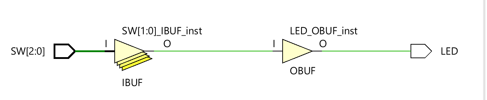

#### Verilog Code

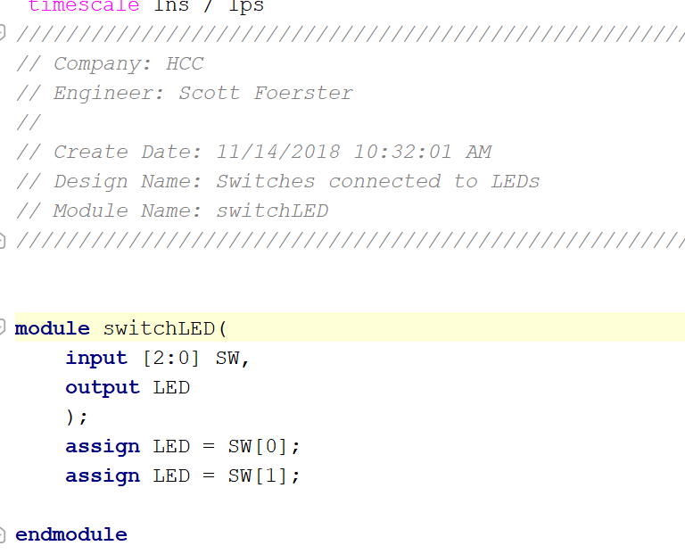

#### RTL Schematic Screen shot

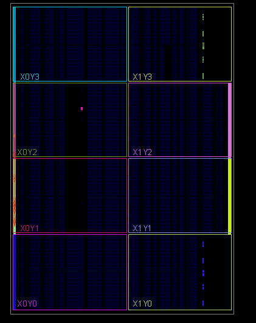

#### Synthesis Schematic Screen shot

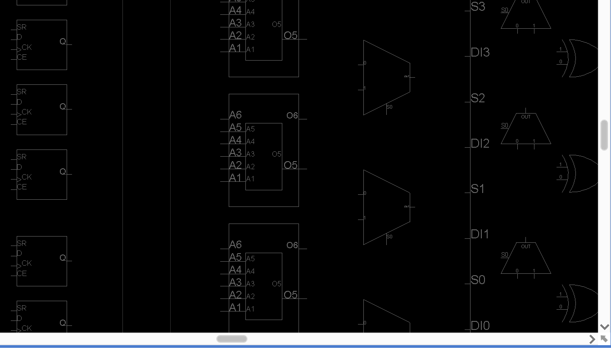

#### Implementation Device screen shot zoomed in on something interesting

#### Testing

*What are the vivado error messages?  Guess what each means in your own words.* 

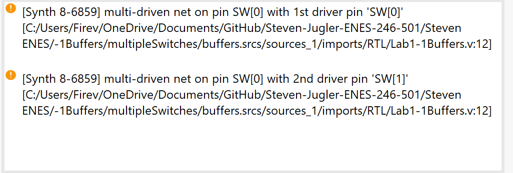

I would assume that the error is that you cannot have multiple switches control the same LED.

*Does vivado fail during RTL Analysis, Synthesis, Implementation or Bit File Generation?* 

**implementation stage.**

*What does the error message multi-driven net mean? What would you look for as an error in your circuit design? *

*What is a multi-driven net?*

****

## BeCreative!

Hook the switches to the LED's in some creative way of your choice using the concepts you learned in this lab.

#### Port Diagram

#### Verilog Code

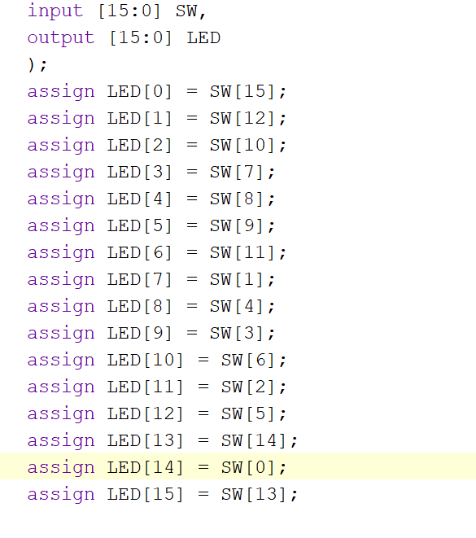

#### RTL Schematic Screen shot

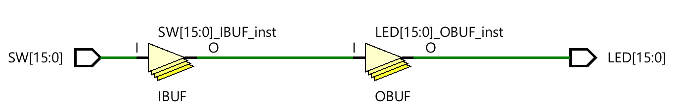

#### Synthesis Schematic Screen shot

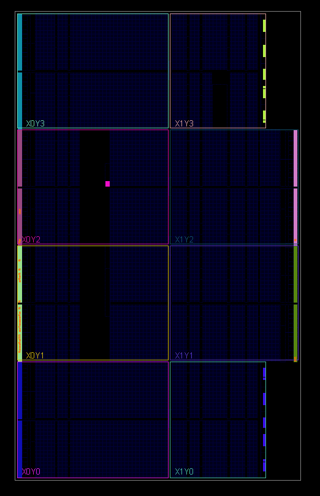

#### Implementation Device screen shot zoomed in on something interesting

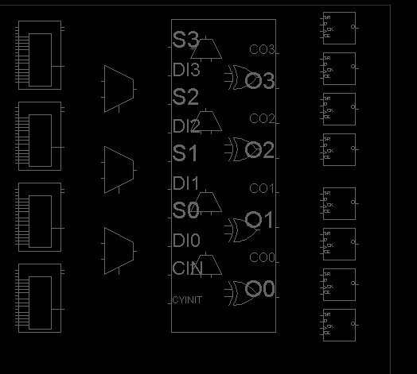

#### Testing

