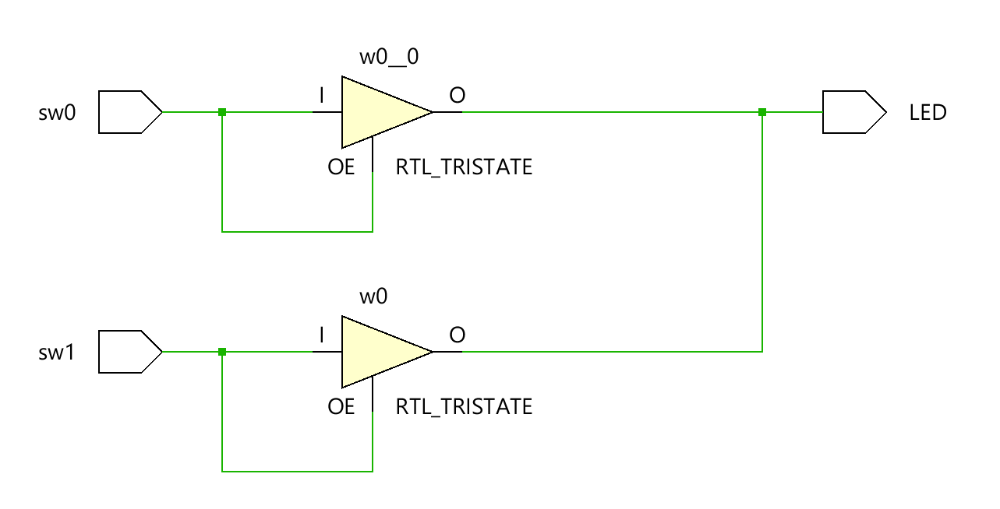
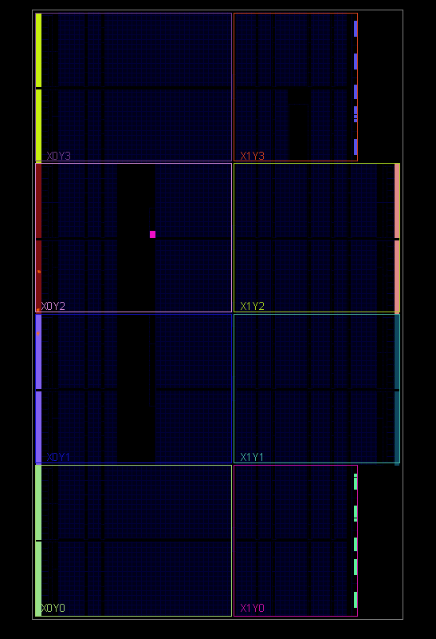
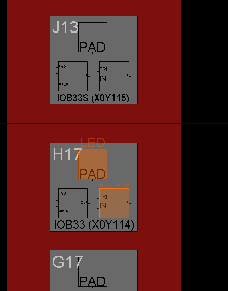
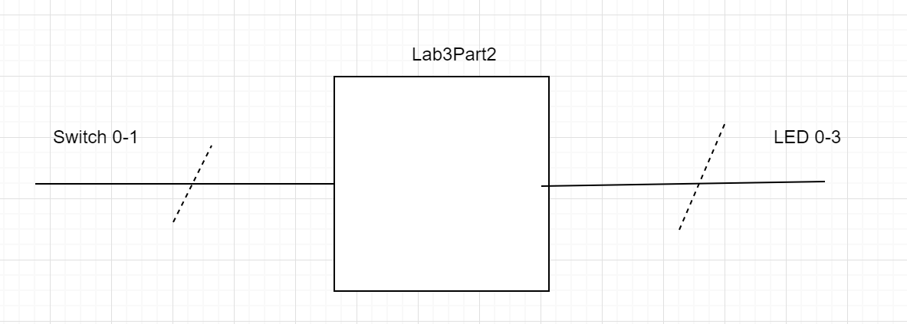
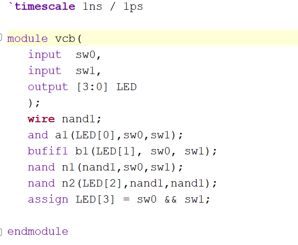
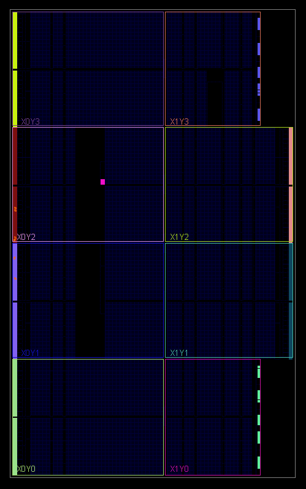
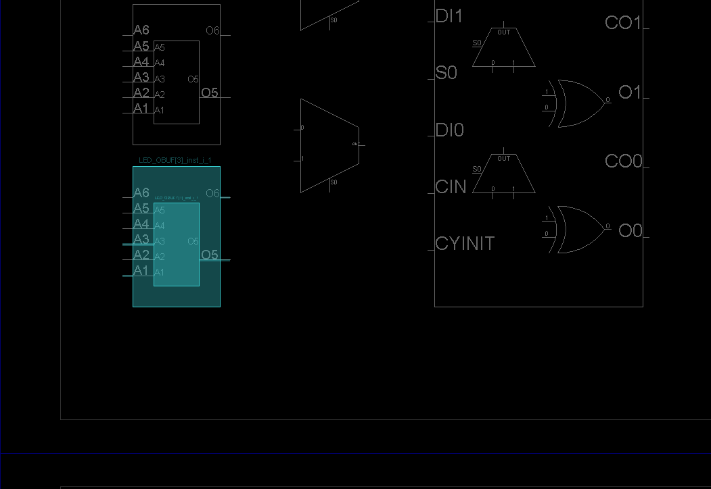

# AndNand
The goals of this lab are to begin looking at the ways **Vivado** modifies our code.   

**Vivado** tires to get rid of constants.   

**Vivado** looks at different verilog abstractions of the same circuit and does what?   

**Vivado** simplifies circuits we tell it to build, freeing us from trying to build efficient circuits.

## project_1 constants

Project_1 is playing with voltage controlled buffers just like the previous lab, except it is using constants.

#### Port Diagram

#### Verilog Code

#### RTL Schematic Screen shot

#### Synthesis Schematic Screen shot

#### Implementation Device screen shot zoomed in on something interesting

#### Testing

*A logical 1 is visible in the verilog code (vcb.v) and yet the RTL analysis schematic gets rid of the logical constant and is identical to the previous lab. Why? Draw a diagram similar to the RTL analysis with containing the design intent of the verilog code.*

*What happens if the order of 1 and sw0  are switched (and the order of 1 and sw1) in the verilog code?*

I**t fails in the implementation stage, ERROR: [DRC MDRV-1] Multiple Driver Nets: Net LED_OBUF has multiple drivers: sw0_IBUF_inst/O, and sw1_IBUF_inst/O.**

Comment out the lines:

​	set_property CFGBVS VCCO [current_design]
​	set_property CONFIG_VOLTAGE 3.3 [current_design]

in the xdc file. 

*What error messages are generated?*   

**None.**

*Which (RTL, Synthesis, Implement or Generate Bitstream) causes failure?* 

**none, it worked.**

*Which starts complaining first about these two lines?*

**none,**

*What technology is in the Xilinx FPGA we are using TTL, CMOS, etc. ? Provide a link to the web site where you looked up the answer.*

*What is w in the verilog code? Is it necessary?* 

**it is a variable,. it is not necessary, but it is helpful.**

## project_2 and Gates

In this project an "And" gate is created four different ways. Test it. Show your instructor all four ways working. 

#### Port Diagram

#### Verilog Code

#### RTL Schematic Screen shot

#### Synthesis Schematic Screen shot

#### Implementation Device screen shot zoomed in on something interesting

#### Testing

*Which of the four ways is the most attractive way to code?*

*At what level of verilog code abstraction is the **assign** command?*

*Does order of the verilog commands (sequence of commands) change anything?*

*What are a1,b1,n1,n2 associated with the gate names called in Verilog?*

*In the language C, the names between () look like variables passing data to some kind **of function, object or subroutine. What do the represent in verilog?* 

*At what step (RTL, Synthesis, Implementation, BitFile) did Vivado figure out that most of the LED's were doing the same thing?* 

*Implement each and gate one at a time. List any differences between them at the RTL or Synthesis states here. Take screen shots if you want or describe them verbally.* 

## project_3 XOR and Nand Gates

You create this from scratch.

Use the "[assign](https://www.utdallas.edu/~akshay.sridharan/index_files/Page5212.htm)" command, 3 switches, and 2 LEDs to create a three input Nand gate and a three input XOR gate. Put them all in one project. 

#### Port Diagram

#### Verilog Code

#### RTL Schematic Screen shot

#### Synthesis Schematic Screen shot

#### Implementation Device screen shot zoomed in on something interesting

#### Testing

*XOR gates have evolved with [two different implementations](https://en.wikipedia.org/wiki/XOR_gate#More_than_two_inputs) with three or more inputs.  Which does the verilog assign command implement?*

## Ethics

The ethics questions below are more important than your answers. The goal in answering them is to remember the question. So the best answers are a non-trivial, thoughtful, relevant hypothesis. 

#### Ethics of EDIF

EDIF (Electric Design Interchange Format)  captures a battle between engineers trying to use tools like Vivado and engineers designing Vivado. They both have to make money. *Summarize this wikipedia article  on the death of [EDIF](https://en.wikipedia.org/wiki/EDIF) standards in less than 200 words:*

This course is asking you to document circuits first with the port diagram and then screen shots of Vivado and finally a discussion of testing. You are in the role of an engineering using Vivado on a project. *Which verilog version of the project_1 circuit (simple or complex) should be entered into Vivado?  When is a more complex circuit a good thing and a simplified, reduced circuit a bad thing?*

